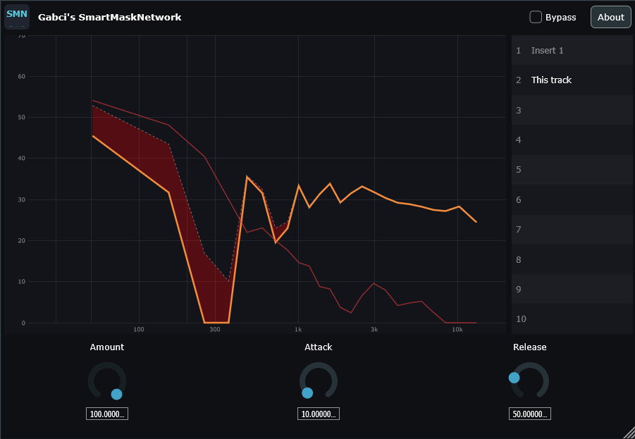

# Gabci's SmartMask Network

> Instances on different tracks talk to each other and resolve spectral masking by priority.

[](LICENSE)
[](https://github.com/rcptr2/gabcis-smartmask-network/actions/workflows/build.yml)


🇭🇺 *A magyar leírás: [README.hu.md](README.hu.md)*



*The masked region in red between this track and a higher-priority one, with the network-wide priority list on the right.*

Spectral masking is a whole-mix problem, but a normal plug-in only sees one track. SmartMask Network
is a set of instances that see each other: put one on every track that competes for space, give each
a priority, and they negotiate. Where a higher-priority track is masking a lower-priority one, only
the offending frequency bands on the lower-priority track are ducked — everything else is left alone.

Built with [JUCE](https://juce.com).

## How it works

- **Shared registry** — every instance registers itself in a process-wide registry, publishing its
  own spectrum and priority and reading everyone else's.
- **Spectral engine** — an FFT-based analyser produces the per-band levels that the comparison runs
  on.
- **Masking processor** — for each band, an instance checks whether a higher-priority instance is
  currently dominating it, and applies gain reduction only there, with its own attack and release.
- **Cross-instance priority editing** — the full priority list is editable from *any* open instance,
  not only the one you happen to have on screen. Because a plug-in instance has no pointer to another
  instance's parameter tree, this goes through a request channel in the registry; a conflict swaps
  the two priorities rather than silently overwriting one.
- **Spectrum visualiser and priority list** — the state of the whole network is visible from every
  instance.

## Parameters

| Parameter | Range | Default | Description |
|---|---|---|---|
| Priority | 1 – 10 | 5 | Rank of this track in the network. Lower-priority tracks give way to higher-priority ones. |
| Amount | 0 – 100 % | 100 % | Scales the gain reduction applied to masked bands. |
| Attack | 5 – 200 ms | 10 ms | How quickly ducking engages. |
| Release | 5 – 200 ms | 50 ms | How quickly ducking recovers. |
| Bypass | on / off | off | Full bypass; the instance stays registered. |

## Usage

1. Insert an instance on every track that competes for the same spectral space.
2. Set a priority on each — lead vocal high, pad low, for example.
3. Adjust Amount, Attack and Release to taste. The priority list can be rearranged from any instance.

## Installation

Pre-built binaries are on the
[Releases](https://github.com/rcptr2/gabcis-smartmask-network/releases) page.

### Windows x64

1. Download `SmartMaskNetwork-vX.Y.Z-Windows-x64-VST3.zip`.
2. Unzip it and copy the `SmartMask Network.vst3` folder into `C:\Program Files\Common Files\VST3\`.
3. Rescan plug-ins in your DAW.

### macOS (Intel)

The macOS binary is **x86_64 (Intel)**. It runs natively on Intel Macs and under Rosetta 2 in an
Intel-mode host on Apple Silicon; there is no arm64 slice.

1. Download `SmartMaskNetwork-vX.Y.Z-macOS-Intel-VST3.zip`.
2. Unzip it and copy `SmartMask Network.vst3` into `/Library/Audio/Plug-Ins/VST3/`
   (or `~/Library/Audio/Plug-Ins/VST3/` for the current user only).
3. The build is not notarised, so clear the quarantine flag:
   ```bash
   xattr -dr com.apple.quarantine "/Library/Audio/Plug-Ins/VST3/SmartMask Network.vst3"
   ```
4. Rescan plug-ins in your DAW.

> Instances communicate within a single host process. Tracks hosted in separate processes — some
> DAWs sandbox plug-ins individually — will not see each other.

## Building from source

### Requirements

- CMake 3.24 or newer
- A C++20 compiler — **Visual Studio 2022** (Desktop development with C++) on Windows,
  **Xcode 15+** on macOS
- Git

JUCE 9.0.0 is pinned in `CMakeLists.txt` and downloaded automatically by CMake's `FetchContent` at
configure time. MinGW is not supported: JUCE rejects it explicitly, and its Windows backend needs
MSVC intrinsics and the Direct2D/DirectWrite headers.

> **The build directory path must not contain an apostrophe.** JUCE's generated VST3 `POST_BUILD`
> steps do not escape apostrophes in the shell command chains they emit. `CMakeLists.txt` checks for
> this and stops with a clear error rather than failing later.

### Windows

```bash
cmake -S . -B build -G "Visual Studio 17 2022" -A x64 -DSMARTMASK_BUILD_TESTS=OFF
cmake --build build --config Release --target SmartMaskNetworkPlugin_VST3
```

### macOS

```bash
cmake -S . -B build -G Xcode -DCMAKE_OSX_ARCHITECTURES=x86_64 -DSMARTMASK_BUILD_TESTS=OFF
cmake --build build --config Release --target SmartMaskNetworkPlugin_VST3
```

The finished bundle is written to
`build/SmartMaskNetworkPlugin_artefacts/Release/VST3/SmartMask Network.vst3`.

### Tests

The suite uses [Catch2](https://github.com/catchorg/Catch2), fetched automatically, and registers
with CTest. It covers the registry, the spectral engine, the masking processor, the processor itself,
and CPU load:

```bash
cmake -S . -B build -DSMARTMASK_BUILD_TESTS=ON
cmake --build build --config Release
ctest --test-dir build -C Release --output-on-failure
```

## Project layout

```
Source/          Plug-in source — processor, editor, registry, spectral engine,
                 masking processor, spectrum visualiser, priority list component
Tests/           Catch2 unit tests — registry, spectral engine, masking, processor, load
docs/            PDF overviews (EN/HU) and design plan
CMakeLists.txt   Build definition; pins JUCE 9.0.0
CHANGELOG.md     Development history
```

## Tested with

- **macOS** (Intel, x86_64) — FL Studio 2026
- **Windows 11 x64** — FL Studio 2026

## Status

Version 0.13.0. The major version stays at `0` while development is paused at a feature-complete,
tested state; see [CHANGELOG.md](CHANGELOG.md).

## Performance


Measured in FL Studio 2026 on Windows 11 x64, on an ASUS ZenBook 13 with an Intel
Core i7-1065G7 — a low-power four-core laptop CPU, not a workstation. All seven
plug-ins ran simultaneously in the same project, with two stock Image-Line plug-ins
included for reference. The figures are FL Studio's own, captured with
*Reset on transport* enabled so that one-off initialisation spikes are excluded.

| Plug-in | CPU % | Time | Peak |
|---|---:|---:|---:|
| Gabci's AeroDynamics Pro | 17 | 251 | 353 |
| FLEX Bass *(Image-Line, reference)* | 9 | 125 | 275 |
| Gabci's MasterClear | 4 | 53 | 264 |
| **Gabci's SmartMask Network *(instance 1)*** | **3** | **43** | **554** |
| Gabci's PhaseLock Sub | 3 | 41 | 1306 |
| Emphasizer *(Image-Line, reference)* | 2 | 34 | 117 |
| Gabci's Acoustic Cloak | 2 | 36 | 191 |
| Gabci's MorphicPhaser | 2 | 27 | 152 |
| **Gabci's SmartMask Network *(instance 2)*** | **1** | **16** | **498** |
| Gabci's SpectralCarve Pro | 1 | 19 | 751 |

## Licence

Released under the **GNU Affero General Public License v3.0 or later** — see [LICENSE](LICENSE).

This choice is not arbitrary. SmartMask Network is built with JUCE 9, which is dual-licensed under
the AGPLv3 and a commercial JUCE licence. Distributing a binary built from this source under the
AGPLv3 branch is what makes it free to publish, and it obliges any derived work to be released under
the same terms with its source available.

## Attribution

- [JUCE](https://juce.com) — © Raw Material Software Limited, used here under the AGPLv3.
- [Catch2](https://github.com/catchorg/Catch2) — Boost Software License 1.0 (test builds only).
- VST® is a registered trademark of Steinberg Media Technologies GmbH. The VST 3 SDK bundled with
  JUCE is distributed by Steinberg under the MIT licence.

## Author

Gábor Tomori — *Gabci Audio*
